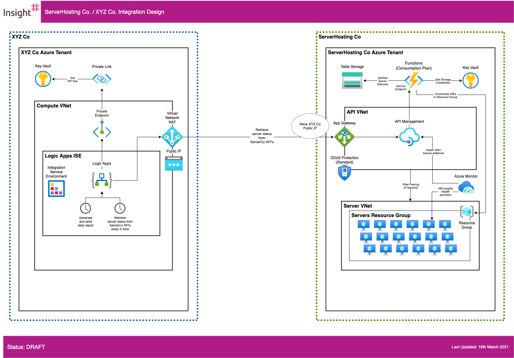

# Solution Overview

## XYZ Co

### Networking
* XYZ Co is provisioned within the XYZ Co Azure tenancy. It is comprised of a `Compute VNet` which hosts a Logic Apps Integration Service Environment, which allows for a dedicated execution environment for the Logic Apps instance. For clarity, an environment design is not described here.
* A Virtual Network NAT application has been provisioned to the `Compute VNet` in conjunction with a Public IP to all a predictable static IP to be presented to ServerHost Co's App Gateway for IP whitelisting.

### Logic Apps
* The Logic Apps instance is able to securely retrieve API Key and Storage Credentials from multi-tenanted Key Vault over a Private Link using a Private Endpoint. In this case the traffic between Logic Apps and key Vault does not traverse the public Internet. Connectivity to multi-tenanted Table Storage is secured in the same way.
* The Logic Apps instance contains two apps:
    * An app with scheduled trigger to make a REST API call to ServerHost Co.'s public service with a 5 min interval, 24/7.
    * An app with scheduled trigger to retrieve all server statuses retrieved within the last reporting period and generate a .CSV file.
        * Note that the downstream system for sending the daily report to is not defined in the specification and will require elaboration.

### Key Vault
* Key Vault will be used to securely maintain and access the API Key for calling ServerHost Co's API's. A highly secure solution is shown leveraging Private Endpoint and Private Link so that the credentials are not transmitted over the public Internet, if deemed a requirement by XYZ Co cybersecurity/governance. Key Management between ServerHosting Co and XYZ Co is not covered in this document.

---

## ServerHosting Co

### Networking
* ServerHosting Co is provisioned within the ServerHosting Co Azure tenancy. It is comprised of an `API VNet` which hosts a API Management instance and a `Server VNet` in which all the servers to be monitored reside. For clarity, an environment design is not described here. Peering between VNets is supported if required but a use-case has not yet been identified.
* The incoming REST API call from XYZ Co enters App Gateway, which is a Layer-7 OSI applicance acting as a WAF (Web Application Firewall). It will pass the request to pass to API Management provisioned within `API VNet`. DDos Protection Standard is also recommended to protect `API VNet` although has significant monthly cost and therefore DDos Protection Basic in combination with the WAF from App Gateway may satisfy ServerHosting Co's cybersecurity requirements.

### Function Apps

* The Functions Apps used in the solution are provisioned into multi-tenanted compute using the Consumption Plan. This is recommended given there is no requirement for this compute to execute in an isolated environment or run constantly, given the execution flow is entirely schedule-based. There are three Function Apps deployed:
    * A scheduled trigger Function App to enumerate all virtual machines in the configured resource group within `Server VNet`. This is used to seed a list of all available servers and their current powerstate during each 24 hour period. The trigger is scheduled to run every hour to ensure the set of available servers is kept up-to-date.
    * A Function App acting as a backend service for the incoming REST API call from XYZ Co via APIM. This will return the server uptime data retrieved from Table Storage.
    * A Function App acting as a backend service for the webhook log alert from Azure Monitor (see below).

### Key Vault
* Key Vault will be used to securely maintain and access the Table Storage credentials from the Function Apps using [Key Vault References](https://docs.microsoft.com/en-us/azure/app-service/app-service-key-vault-references).

### Azure Monitor

* [Azure Monitor Alerts](https://docs.microsoft.com/en-gb/azure/azure-monitor/alerts/alerts-overview) will be configured in conjunction with [VM Insights Health](https://docs.microsoft.com/en-us/azure/azure-monitor/vm/vminsights-health-overview) (currenty in preview) when the health status changes for any virtual machine in the configured resource group within `Server VNet`.

* An [Alert Webhook](https://docs.microsoft.com/en-us/azure/azure-monitor/alerts/alerts-log-webhook) action will be configured to call the API operation via APIM with details of the impacted VM(s), which will in-turn invoke the Function App above to update the status in Table Storage. The alert thresholds of a degraded VM health status should be configured to below 5 minutes to account for the expected 5-minute polling frequency from XYZ Co. This soluton benefits from using the Azure control plane and existing monitoring infrastructure to obtain just-in-time updates of server health change rather than a custom polling solution implemented in compute - which would also require additional network traversal rules into `Server VNet`

### Table Storage

* Table Storage is a low-cost, efficient method for long-term data storage with consistent performance. The recommended design for the expected consumer use-cases would be:
    * Table: `StatusByDate`
        * Partition Key: `local date`
        * Row Key: `timestamp`
        * Row Data: JSON payload containing VM health status changes as of timestamp
    * Table: `StatusByServer`
        * Partition Key: `server name`
        * Row Key: `timestamp`
        * Row Data: JSON payload containing VM health status changes as of timestamp

